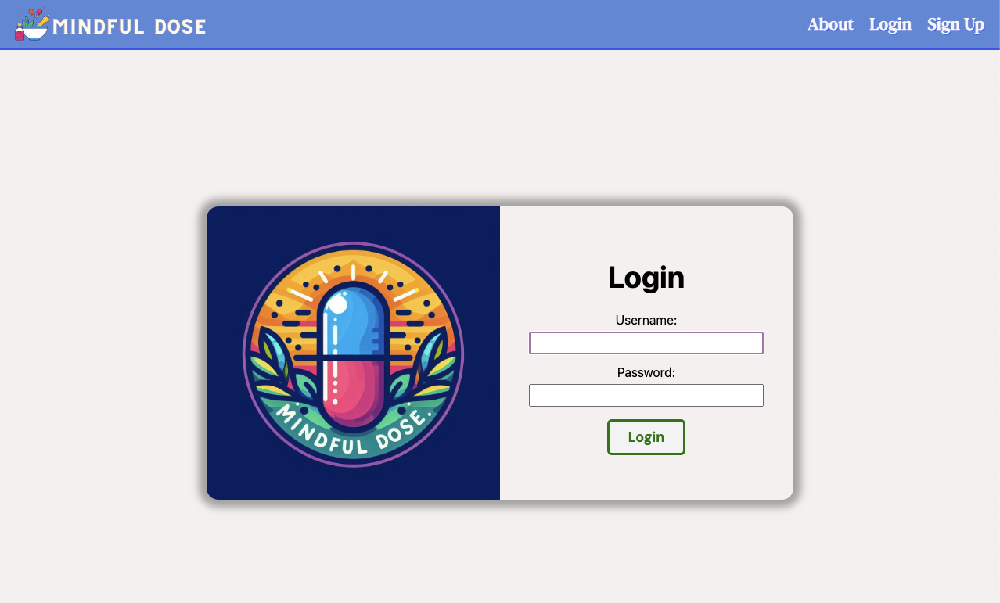

# 
**🧘‍♀️ Mindful Dose 💊**

Mindful Dose allows a user to keep track of their medications in various ways. Whether it be to find a way to stay more consistent with taking your vitamins and supplements or to simply have a way to stay on top of your medications. With Mindful Dose, one can document doses and keep a log of their medication history. 

Stay tuned for updates and additional features!

# [Visit Mindful Dose!](https://mindful-dose.fly.dev/) 📖

# [Planning Materials](https://trello.com/b/TnrAsNot/mindful-dose) 💭 
 
## Technologies used 💻
            

## Attributions 👏
       

- ERD created using [Whimsical](https://whimsical.com/)
- Mindful Dose uses calendar functionality via [MCDatepicker](https://mcdatepicker.netlify.app/)
- Fonts used in Bookworm are sourced via [Google Fonts](https://fonts.google.com/)

## Ice Box 🧊

- [X] Log a Dose
- [ ] Edit/Delete Dose
- [X] Add Photos using AWS
- [ ] Mobile Responsive
- [ ] Dark Mode